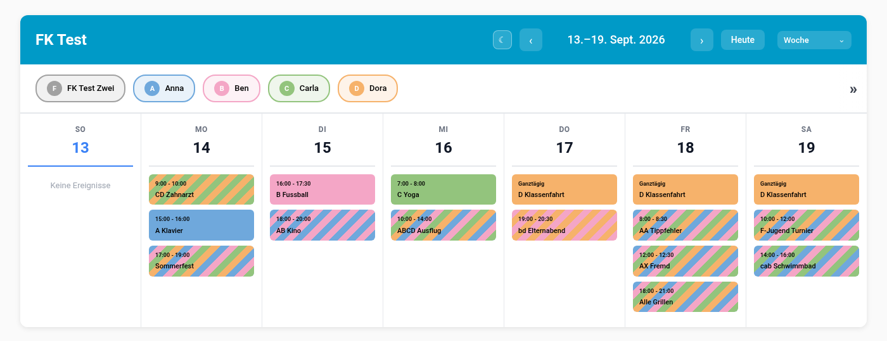

# Familienkalender

Teilt einen gemeinsamen Home-Assistant-Kalender anhand von Kuerzeln im Termintitel in einen Kalender je Person auf. Jede Person hat eine Farbe; Termine mehrerer Personen erscheinen in der Daylight Calendar Card gestreift.

[](https://github.com/DaFlouw/familycalender/releases) [](https://github.com/DaFlouw/familycalender/stargazers) [](https://github.com/DaFlouw/familycalender/commits/main) [](https://hacs.xyz/) [](https://www.home-assistant.io/) [](LICENSE)



Der Quellkalender bleibt unveraendert. Es werden keine Termine kopiert, keine Daten an Dritte uebertragen und kein zweiter Zugang zum Kalenderdienst eingerichtet.

## Inhalt

**[`Installation`](#installation)**  **[`Einrichtung`](#einrichtung)**  **[`Die Kuerzelregel`](#die-kuerzelregel)**  **[`Kalenderkarte`](#kalenderkarte)**  **[`Farben`](#farben)**  **[`Entities`](#entities)**  **[`Einstellungen`](#einstellungen)**  **[`Wie es arbeitet`](#wie-es-arbeitet)**  **[`Transparenz`](#transparenz)**  **[`Lizenz`](#lizenz)**

---

## Installation

**Niedrigste unterstuetzte Home-Assistant-Version:** 2026.9.0

<details>

<summary>Mit HACS (empfohlen)</summary>

<br>

So kommen Aktualisierungen ueber den Home Assistant Community Store zu dir. Jeder Versions-Tag erzeugt automatisch ein GitHub-Release, dem HACS folgt.

1. Ist HACS noch nicht installiert, folge der Anleitung auf [hacs.xyz](https://hacs.xyz/docs/use/download/download/)
2. In der Seitenleiste auf **HACS** gehen
3. Oben rechts auf die drei Punkte, dann auf **Benutzerdefinierte Repositories** — oder gleich den blauen Knopf unten benutzen
4. `DaFlouw/familycalender` eintragen, Kategorie **Integration**, auf **Hinzufuegen**
5. Nach *Familienkalender* suchen und auf **Herunterladen**
6. Home Assistant **neu starten**
7. Weiter bei [Einrichtung](#einrichtung)

</details>

<details>

<summary>Ohne HACS</summary>

<br>

1. Das [aktuelle Release](https://github.com/DaFlouw/familycalender/releases/latest) als ZIP herunterladen
2. Den Ordner `custom_components/family_calendar` daraus nach `<config>/custom_components/` kopieren, sodass `<config>/custom_components/family_calendar/manifest.json` existiert
3. Home Assistant **neu starten**
4. Weiter bei [Einrichtung](#einrichtung)

</details>

<br>

[](https://my.home-assistant.io/redirect/hacs_repository/?owner=DaFlouw&repository=familycalender&category=integration)

<br>

> [!IMPORTANT]
> Ein Neuladen der Integration genuegt nach einer Aktualisierung **nicht**. Home Assistant fuehrt den bereits geladenen Python-Code weiter aus, bis es neu startet.

---

## Einrichtung

Nach dem Neustart unter *Einstellungen → Geraete & Dienste → Integration hinzufuegen* den **Familienkalender** auswaehlen.

[](https://my.home-assistant.io/redirect/config_flow_start/?domain=family_calendar)

1. **Name und Quellkalender.** Der Quellkalender ist ein beliebiger Kalender aus Home Assistant — CalDAV, Google, Local Calendar oder jeder andere. Der Name bezeichnet das Geraet, unter dem die Personenkalender stehen.
2. **Personen.** Fuer jede Person Name, Kuerzel und Farbe. Die Farbe ist mit der naechsten freien Farbe der Palette vorbelegt.
3. **Fertig.** Jede Person hat jetzt einen eigenen Kalender.

Weitere Personen kommen spaeter ueber **Person hinzufuegen** an der Integration dazu. Bestehende lassen sich dort bearbeiten oder entfernen. Mehrere Quellkalender sind moeglich, jeder als eigener Eintrag.

---

## Die Kuerzelregel

Das **erste Wort** des Titels ist das Kuerzel. Es besteht nur aus Buchstaben eingerichteter Personen, jeder hoechstens einmal. Reihenfolge sowie Gross- und Kleinschreibung spielen keine Rolle.

**Ein Titel ohne gueltiges Kuerzel betrifft alle.**

| Titel | betrifft |
|-------|----------|
| `F Zahnarzt` | F |
| `CF Elternabend` | C und F |
| `fc Elternabend` | C und F |
| `ECA Spielplatz` | E, C und A |
| `CAFE Wochenende` | alle vier |
| `Sommerfest` | alle — kein Kuerzel |
| `Alle Grillen` | alle — `Alle` enthaelt fremde Buchstaben |
| `FF Probe` | alle — doppelter Buchstabe |
| `F-Jugend Spiel` | alle — das erste Wort ist `F-Jugend` |

Bei vier Personen gibt es 64 gueltige Kuerzel: jede Kombination in jeder Reihenfolge.

> [!NOTE]
> Nur das erste Wort zaehlt. `E CA Training` betrifft nur E. Ein gewoehnliches Wort, das zufaellig nur aus Kuerzelbuchstaben besteht, gilt ebenfalls als Kuerzel: `Ca 10 Uhr` betrifft C und A.

Ort und Beschreibung spielen fuer die Zuordnung keine Rolle.

---

## Kalenderkarte

Gestreift werden Termine von der [Daylight Calendar Card](https://github.com/superdingo101/daylight-calendar-card). Sie fasst Termine, die in mehreren Kalendern gleich vorkommen, zu einem zusammen und streift ihn in den Farben dieser Kalender. Weil die Personenkalender die Termine unveraendert weitergeben, ist ein Termin von C und F in beiden Kalendern gleich — und erscheint einmal, gestreift.

```yaml
type: custom:daylight-calendar-card
entities:
  - calendar.familienkalender_florian
  - calendar.familienkalender_annabel
  - calendar.familienkalender_elise
  - calendar.familienkalender_claudia
combine_calendars: true
combine_style: stripes
combine_calendars_width: 10
event_color_mode: classic
```

| Feld | Bedeutung |
|------|-----------|
| `combine_calendars` | Gleiche Termine mehrerer Kalender zusammenfassen — Voraussetzung fuer die Streifen |
| `combine_style` | `stripes` fuer Streifen, alternativ `bars` oder `dots` |
| `combine_calendars_width` | Breite eines Streifens in Pixeln |

Die Farben traegt die Integration selbst ein, siehe [Farben](#farben). In der Kopfzeile der Karte laesst sich jede Person einzeln aus- und einblenden.

---

## Farben

Jede Person hat eine Farbe aus dem Farbwaehler. Die vorgeschlagene Palette ist so gewaehlt, dass dunkle Schrift auf jeder Farbe und auf jedem Streifenmuster lesbar bleibt.

Die Farbe landet an drei Stellen:

| Ort | Wirkung |
|-----|---------|
| Attribut `color` des Personenkalenders | Fuer Vorlagen und eigene Karten |
| Kalenderoption der Entity | Farbe im Kalender-Panel von Home Assistant |
| `colors` jeder Daylight Calendar Card, die den Kalender zeigt | Farbe und Streifen auf dem Dashboard |

Der Abgleich mit den Karten laeuft beim Start, nach jeder Aenderung an den Personen und nach jedem Speichern eines Dashboards. So bekommt auch eine neu angelegte Karte die Farben, ohne dass man sie von Hand eintraegt.

> [!NOTE]
> Geaendert wird ausschliesslich der Farbeintrag der eigenen Personenkalender in Daylight-Karten. Andere Karten, andere Kalender und YAML-Dashboards bleiben unberuehrt. Die Integration ist die fuehrende Quelle: eine in der Karte von Hand geaenderte Farbe wird beim naechsten Abgleich zurueckgesetzt. Wer das nicht moechte, schaltet den Abgleich unter *Konfigurieren* ab.

---

## Entities

Je Person ein Kalender `calendar.<name des eintrags>_<name der person>`, zum Beispiel `calendar.familienkalender_claudia`.

| Zustand / Attribut | Inhalt |
|--------------------|--------|
| Zustand | `on`, solange ein Termin der Person laeuft, sonst `off` |
| `message`, `start_time`, `end_time`, … | laufender oder naechster Termin der Person |
| `letter` | Kuerzel der Person |
| `color` | Farbe als Hex-Wert |

Die Kalender lassen sich wie jeder andere verwenden: in Automationen, mit `calendar.get_events` und im Kalender-Panel.

---

## Einstellungen

Ueber *Konfigurieren* an der Integration:

| Einstellung | Bedeutung |
|-------------|-----------|
| **Quellkalender** | Kalender, dessen Termine aufgeteilt werden |
| **Farben in Dashboards eintragen** | Farbabgleich mit Daylight-Karten, Vorgabe an |

Personen werden an der Integration selbst hinzugefuegt, bearbeitet und entfernt.

---

## Wie es arbeitet

```
custom_components/family_calendar/
  domain/           Kuerzelregel, Farben, Kartenabgleich (ohne Home Assistant)
  config_flow.py    Einrichtung, Optionen, Personen
  coordinator.py    Zugriff auf den Quellkalender
  calendar.py       ein Kalender je Person
  dashboard_sync.py Farben in Daylight-Karten eintragen
```

**Keine Kopie.** Fragt eine Karte oder Automation Termine ab, fragt der Personenkalender den Quellkalender und filtert das Ergebnis. Aenderungen im Quellkalender sind damit sofort sichtbar, und es gibt nichts zu synchronisieren.

**Eine Abfrage je Karte.** Eine Karte fragt alle Personenkalender zugleich nach demselben Zeitraum. Das Ergebnis wird 30 Sekunden vorgehalten, so geht dafuer nur eine Abfrage an den Quellkalender — bei entfernten Diensten wie iCloud spuerbar.

**Zustand.** Den laufenden oder naechsten Termin bestimmt die Integration alle 15 Minuten und zusaetzlich bei jeder Zustandsaenderung des Quellkalenders.

**Umbenennen.** Der Quellkalender wird ueber seine Registry-ID gefuehrt. Wird er umbenannt, folgt der Eintrag; wird er entfernt, wartet der Eintrag, bis unter *Konfigurieren* ein neuer gewaehlt ist.

---

## Transparenz

Diese Integration wurde mit Unterstuetzung eines KI-Assistenten (Claude) entwickelt. Entwurf, Pruefung und Freigabe lagen beim Menschen.

Die Integration selbst enthaelt **keine** KI: sie wendet ausschliesslich die oben beschriebene, feste Kuerzelregel an. Es werden keine Daten an Dritte uebertragen.

Damit greifen die Transparenzpflichten aus Artikel 50 der KI-Verordnung (EU) 2024/1689 hier nicht: sie gelten fuer KI-Systeme, waehrend regelbasierte Software ausdruecklich ausgenommen ist. Dieser Absatz ordnet ein und ist keine Rechtsberatung.

---

## Lizenz

MIT, siehe [LICENSE](LICENSE).
